<div id="top"></div>

  <h2 align="center">OOP Project</h2>
  <h3 align="center">Ahmed Walid</h3>
  <h3 align="center">Ahmed Mohamed</h3>
  <h3 align="center">Alsayed Aly</h3>
  
  <p align="center">
    Simple ordering system
    <br />
    <a href="https://github.com/ahmeddwalid/OOP-project/blob/main/README.md"><strong>Explore the docs »</strong></a>
    <br />
    <br />
    <a href="https://github.com/ahmeddwalid/OOP-project/issues">Report Bug</a>
    ·
    <a href="https://github.com/ahmeddwalid/OOP-project/pulls">Request Feature</a>
  </p>
</div>


<!-- TABLE OF CONTENTS -->
<details>
  <summary>Table of Contents</summary>
  <ol>
    <li>
      <a href="#about-the-project">About The Project</a>
   </li>
   <li><a href="#features">Features</a></li>
    <li><a href="#the-uml">The UML</a></li>
    <li><a href="#the-java-code">The Code</a></li>
    <li><a href="#the-runtime">The Runtime</a></li>
    <li><a href="#contributing">Contributing</a></li>
    <li><a href="#license">License</a></li>
    <li><a href="#contact">Contact</a></li>
    <li>
    <a href="#acknowledgments">Acknowledgments</a>
    </li>
  </ol>
</details>


<!-- ABOUT THE PROJECT -->
## About The Project


In this project a simple ordering system is implemented in which the user has a shopping menu displayed with the following:

- Main menu:
~~~
Pizza, $40
Cheeseburger, $20
Coffee, $5
Soda, $4
Water, $2
~~~
- Takes input from the user that represents each item and its quantity.
- Adds the items with their quantities to the user’s shopping cart.
- On checkout, takes input from the user representing their payment method (PayPal or CreditCard).
- Calculates and displays the amount of the order to the user and performs the payment using the method determined by the user and displays a confirmation message of the payment status (success or failure).


<p align="right">(<a href="#top">back to top</a>)</p>


<!-- FEATURES -->
## Features

- UML diagram
- JOptionPane is used for the GUI to display and take inputs from the user
- Added an abstract classes
- Added polymorphism
- Added screenshots of the run 

<p align="right">(<a href="#top">back to top</a>)</p>


<!--UML-->
# The UML

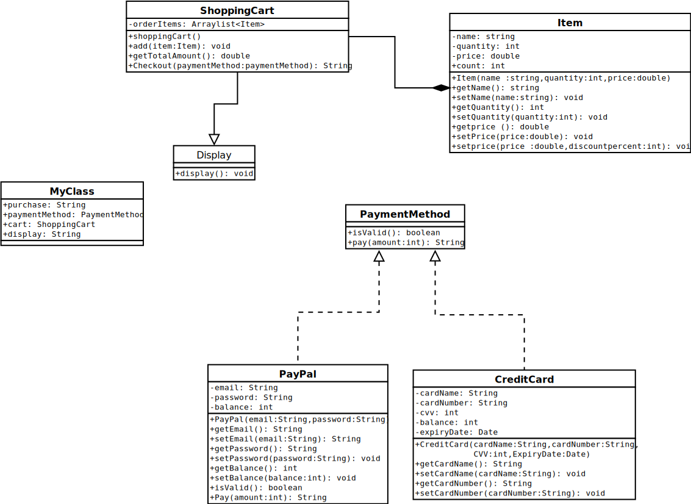

<p align="right">(<a href="#top">back to top</a>)</p>

<!--CODE-->
# The Java code

### MyClass.java
~~~
package project;

import javax.swing.JOptionPane;
import java.util.Date;

public class MyClass {

    public static void main(String[] args) {
        String purchase;
        PaymentMethod PaymentMethod;   // polymorphism 
        ShoppingCart cart = new ShoppingCart();
        do {
            String name = JOptionPane.showInputDialog("Please, select a product:\n-   Pizza, $40 \n-   Cheeseburger, $20\n-   Coffee, $5\n-   Soda, $4\n-   Water, $2\n" + "\nEnter item’s name ");
            double price = Double.parseDouble(JOptionPane.showInputDialog("Please, select a product:\n-   Pizza, $40 \n-   Cheeseburger, $20\n-   Coffee, $5\n-   Soda, $4\n-   Water, $2\n" + "\nEnter item’s Price "));
            int quantity = Integer.parseInt(JOptionPane.showInputDialog("Please, select a product:\n-   Pizza, $40 \n-   Cheeseburger, $20\n-   Coffee, $5\n-   Soda, $4\n-   Water, $2\n" + "\nEnter item’s Quantity "));

            Item item = new Item(name, quantity, price);
            cart.add(item);
            String discountInput = JOptionPane.showInputDialog("Do you have discount? (Y/N)");
            if (discountInput.equals("Y") || discountInput.equals("y")) {
                int discountAmount = Integer.parseInt(JOptionPane.showInputDialog("Enter Discount Percentage"));
                item.setPrice(price, discountAmount);
            }
            purchase = JOptionPane.showInputDialog("Proceed to checkout (Y/N)");
        } while (purchase.equals("N") || purchase.equals("n"));
        String choice = JOptionPane.showInputDialog("choose a payment method (PayPal or CreditCard)");
        if (choice.equals("Paypal") || choice.equals("paypal") || choice.equals("PayPal")) {
            String email = JOptionPane.showInputDialog("Enter Email ");
            String Password = JOptionPane.showInputDialog("Enter Password ");
            int balance = Integer.parseInt(JOptionPane.showInputDialog("Enter Balance"));
            PaymentMethod = new PayPal(email, Password);                //polymorphism
            ((PayPal) PaymentMethod).setBalance(balance);
            if (PaymentMethod.isValid()) {
                JOptionPane.showMessageDialog(null, "Valid", "PaymentMethod", JOptionPane.INFORMATION_MESSAGE);
            } else {
                JOptionPane.showMessageDialog(null, "InValid", "PaymentMethod", JOptionPane.INFORMATION_MESSAGE);
            }

        } else {
            String name = JOptionPane.showInputDialog("Enter cardName ");
            String cardNumber = JOptionPane.showInputDialog("Enter cardNumber ");
            int cvv = Integer.parseInt(JOptionPane.showInputDialog("Enter cvv"));
            int year = Integer.parseInt(JOptionPane.showInputDialog("Enter expiryDate (year)"));
            int month = Integer.parseInt(JOptionPane.showInputDialog("Enter expiryDate (month)"));
            int day = Integer.parseInt(JOptionPane.showInputDialog("Enter expiryDate (day)"));
            Date expiryDate = new Date(year - 1900, month - 1, day);

            int Balance = Integer.parseInt(JOptionPane.showInputDialog("Enter Balance"));

            PaymentMethod = new CreditCard(name, cardNumber, cvv, expiryDate);
            ((CreditCard) PaymentMethod).setBalance(Balance);
            if (PaymentMethod.isValid()) {
                JOptionPane.showMessageDialog(null, "Valid", "PaymentMethod", JOptionPane.INFORMATION_MESSAGE);
            } else {
                JOptionPane.showMessageDialog(null, "InValid", "PaymentMethod", JOptionPane.INFORMATION_MESSAGE);
            }

        }
        JOptionPane.showMessageDialog(null, cart.checkout(PaymentMethod), "CheckOut", JOptionPane.INFORMATION_MESSAGE);

        String display = JOptionPane.showInputDialog("DO you want to see what's in your cart? (Y/N)");
        if (display.equals("Y") || display.equals("y")) {
            cart.display();
        }

    }

}
~~~

### Item.java
~~~
package project;
public class Item 
{
    private String name;
    private int quantity;
    private double price;
    public static int count = 0;
    Item(String name,int quantity,double price)
    {
        this.name=name;
        this.quantity=quantity;
        this.price=price;
                count++;
    }

    public String getName() {
        return name;
    }

    public void setName(String name) {
        this.name = name;
    }

    public int getQuantity() {
        return quantity;
    }

    public void setQuantity(int quantity) {
        this.quantity = quantity;
    }

    public void setPrice(double price) {
        this.price = price;
    }
   
    public void setPrice(double price, int discountPercent) {
        this.price = ((price * discountPercent) / 100);        // OverLoading
    }
     public double getPrice() {
        return price;
    }
}
~~~

### PaymentMethod.java
~~~
package project;

public interface PaymentMethod {

    public boolean isValid();

    public String pay(int amount);
}
~~~

### PayPal.java
~~~
package project;

import java.util.regex.*;
import javax.swing.JOptionPane;

public class PayPal implements PaymentMethod {

    private String email, password;
    private int balance;

    PayPal(String email, String password) {
        this.email = email;
        this.password = password;
        balance = 0;
    }

    public String getEmail() {
        return email;
    }

    public void setEmail(String email) {
        this.email = email;
    }

    public String getPassword() {
        return password;
    }

    public void setPassword(String password) {
        this.password = password;
    }

    public int getBalance() {
        return balance;
    }

    public void setBalance(int balance) {
        this.balance = balance;
    }

    @Override
    public boolean isValid() {
        //email
        String emailRegex = "^[a-zA-Z0-9._%+-]+@[a-zA-Z0-9.-]+\\.[a-zA-Z]{2,6}$";
        Pattern emailPattern = Pattern.compile(emailRegex);
        Matcher emailMatcher = emailPattern.matcher(email);

        //password
        String passwordRegex = "^(?=.*[0-9])(?=.*[a-z])(?=.*[A-Z])(?=.*[@#$%^&+=])(?=\\S+$).{8,}$";
        Pattern passwordPattern = Pattern.compile(passwordRegex);
        Matcher passwordMatcher = passwordPattern.matcher(password);

        return (emailMatcher.matches() && passwordMatcher.matches());
    }

    @Override
    public String pay(int amount) {
        if (isValid() && amount <= balance) {
            balance -= amount;
            return "Successful Remaining balance = " + balance;
        } else {
            return "failed";
        }

    }
}
~~~

### CreditCard.java
~~~
package project;

import java.util.Date;

public class CreditCard implements PaymentMethod {

    private String cardName, cardNumber;
    private int cvv, balance;
    private Date expiryDate;

    CreditCard(String cardName, String cardNumber, int cvv, Date expiryDate) {
        balance = 0;
        this.cvv = cvv;
        this.cardName = cardName;
        this.expiryDate = expiryDate;
    }

    public String getCardName() {
        return cardName;
    }

    public void setCardName(String cardName) {
        this.cardName = cardName;
    }

    public String getCardNumber() {
        return cardNumber;
    }

    public void setCardNumber(String cardNumber) {
        this.cardNumber = cardNumber;
    }

    public int getCvv() {
        return cvv;
    }

    public void setCvv(int cvv) {
        this.cvv = cvv;
    }

    public int getBalance() {
        return balance;
    }

    public void setBalance(int balance) {
        this.balance = balance;
    }

    public Date getExpiryDate() {
        return expiryDate;
    }

    public void setExpiryDate(Date expiryDate) {
        this.expiryDate = expiryDate;
    }

    @Override
    public boolean isValid() {
        Date CurrentDate = new Date();
        return expiryDate.after(CurrentDate);
    }

    public String pay(int amount) {
        if (isValid() && balance >= amount) {

            balance -= amount;

            return "Successful Remaining balance = " + balance;
        } else {
            return "failed";
        }
    }
}
~~~

### Display
~~~
package project;

public abstract class Display {

    public abstract void display();
}
~~~

### ShoppingCart.java
~~~
package project;

import javax.swing.JOptionPane;
import java.util.ArrayList;

public class ShoppingCart extends Display {

    ArrayList<Item> orderItems;

    public ShoppingCart() {
        orderItems = new ArrayList<>();      // composition relationship
    }

    public void add(Item item) {
        if (orderItems.size() < 10) {
            orderItems.add(item);
        } else {
            JOptionPane.showMessageDialog(null, "Error", "Add Item", JOptionPane.INFORMATION_MESSAGE);
        }
    }

    public void remove(Item item) {
        if (!orderItems.isEmpty() && orderItems.contains(item)) {
            orderItems.remove(item);
        } else {
            JOptionPane.showMessageDialog(null, "Error", "remove Item", JOptionPane.INFORMATION_MESSAGE);
        }

    }

    public double getTotalAmount() {
        double total = 0;
        for (int i = 0; i < orderItems.size(); i++) {
            total += (orderItems.get(i).getPrice()) * (orderItems.get(i).getQuantity());
        }
        return total;
    }

    public String checkout(PaymentMethod paymentMethod) {
        JOptionPane.showMessageDialog(null, "number of items in your Cart = " + Item.count + " And Your TotalAmount = " + getTotalAmount(), "Checkout", JOptionPane.INFORMATION_MESSAGE);
        return paymentMethod.pay((int) getTotalAmount());
    }

    @Override
    public void display() // Override (Abstract class)
    {
        for (int i = 0; i < orderItems.size(); i++) {

            JOptionPane.showMessageDialog(null, "item in index (" + (i + 1) + ") :\n" + "item’s name:" + orderItems.get(i).getName() + "\n" + "item’s price :" + orderItems.get(i).getPrice() + "\n" + "item’s Quantity :" + orderItems.get(i).getQuantity(), "Display", JOptionPane.INFORMATION_MESSAGE);
        }
    }
}
~~~


<p align="right">(<a href="#top">back to top</a>)</p>

<!--RUNTIME-->
# The Runtime
#### *All test cases*

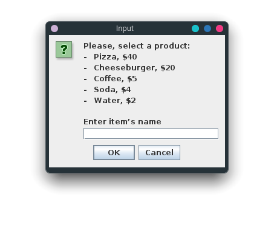
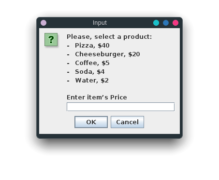
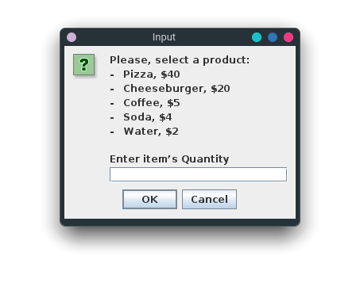
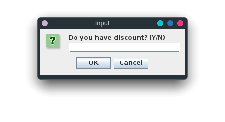
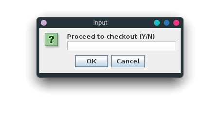
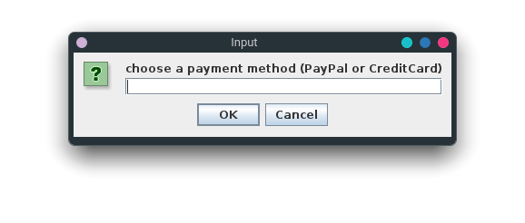


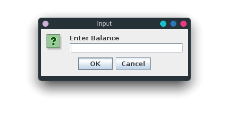
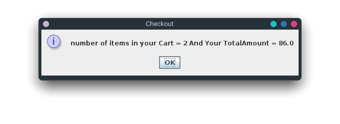
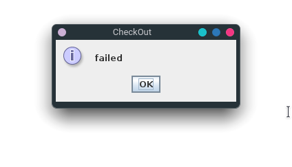
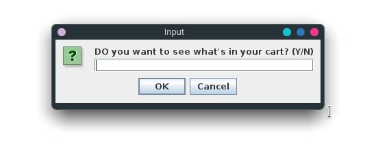
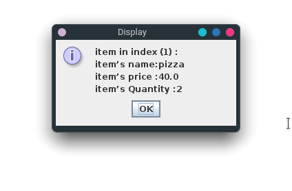

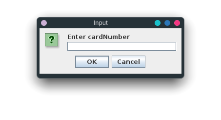
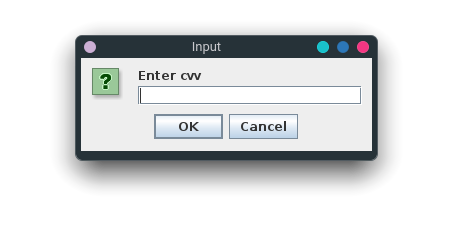


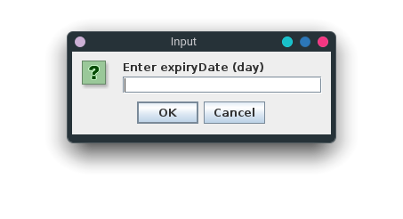

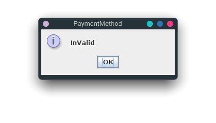
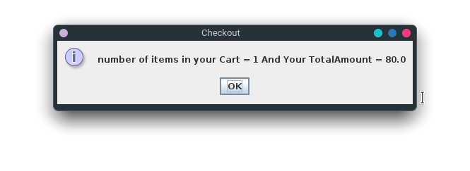
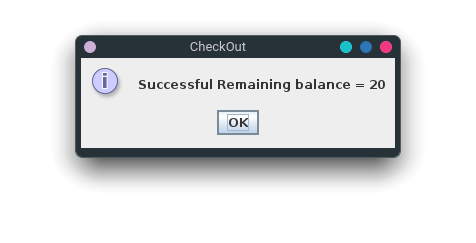
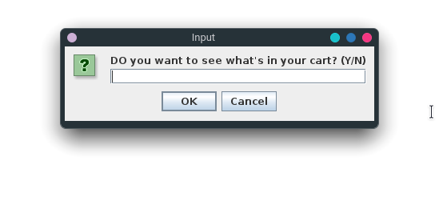
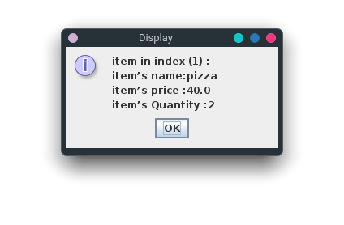
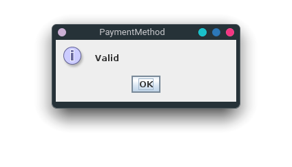

<p align="right">(<a href="#top">back to top</a>)</p>


<!-- CONTRIBUTING -->
# Contributing

Any contributions you make are **greatly appreciated**.


Project Link: [https://github.com/ahmeddwalid/OOP-project](https://github.com/ahmeddwalid/OOP-project)

<p align="right">(<a href="#top">back to top</a>)</p>


<!-- LICENSE -->
# License

This project is distributed under the [MIT License](https://choosealicense.com/licenses/mit/). See
[```LICENSE.txt```](/LICENSE) for more information.

<p align="right">(<a href="#top">back to top</a>)</p>


<!-- CONTACT -->
# Contact

Ahmed Walid
- [Email](ahmedwalid.c3301@gmail.com)

Ahmed Mohamed
- [Email](ahmedelgeen3@gmail.com)

Alsayed Aly
- [Email](sayedalymadany@gmail.com)
<p align="right">(<a href="#top">back to top</a>)</p>


<!-- ACKNOWLEDGMENTS -->
# Acknowledgments

* [Java Documentation](https://docs.oracle.com/en/java/)
* Mohaned ElDeeb [get in touch](mohanedeldeeb27@gmail.com)

<p align="right">(<a href="#top">back to top</a>)</p>

